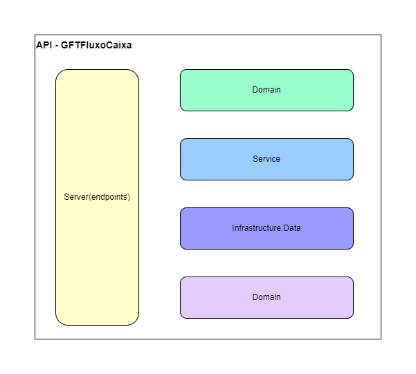
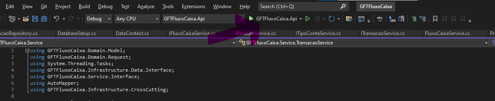
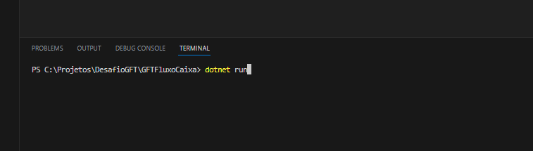

# GFTFluxoCaixa

This is a challenge made by GFT.

Objective: A merchant needs to control his daily cash flow with entries (debits and credits), he also needs a report that provides the consolidated daily balance.

Solution:
- Rest Api
- Tecnology: .NET
- Librarys:
    * Swagger
    * Dapper
    * AutoMapper
    * Sqlite
 
<b>Softwares that you need:</b>
- Visual Studio / Visual Studio Code
- .NET SDK (3.1)
- Postman
   

 

<b>How to run</b>
1. Clone this repository
2. Start the api by running dotnet run from the command line in the project root folder
   - Example:
        * Visual Studio
             - Open solution and click on run button(GFTFluxoCaixa.Api)

        * Visual Studio Code
             - Open solution on Visual Studio Code, open Terminal and run dotnet run like this:

